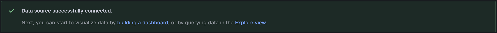
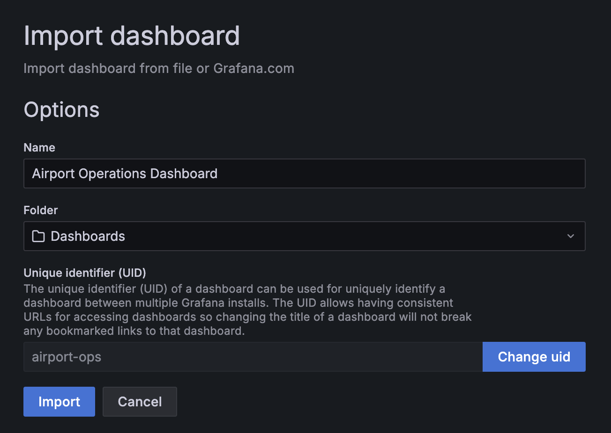

# [Unifor] Monitoramento e análise de logs

Repositório dedicado à disciplina **Monitoramento e análise de logs**, ministrada pelo professor Nauber Gois na Especialização em Engenharia de Software com DevOps, curso de pós-graduação lato sensu da Universidade de Fortaleza (UNIFOR).

## Airport Logging System

### Equipe

- Ismália Santiago (2328703)
- João Victor Mesquita (2416898)
- Pedro Luiz (2328034)
- Samuel Constatino (2419565)

### Componentes do sistema

1. **Grafana**: Plataforma de visualização (porta 3000).
1. **Loki**: Sistema de agregação de logs (porta 3100).
1. **Promtail**: Agente de coleta de logs.
1. **Airport Log Generator**: Script em Python 3.13 que gera logs simulados de um aeroporto.

### Pré-requisitos

- Docker (v20.10 ou maior)
- Docker Compose (v2.0 ou maior)

### Instruções de execução

1. Execute o sistema usando Docker Compose:

```bash
docker compose up -d
```

2. Acesse o Grafana em http://localhost:3000
    - Username: `admin`
    - Password: `admin`


3. Adicione uma nova conexão com o Loki:
    - Acesse *Connections > Add new connection*.
    - Pesquise por **Loki** e selecione-o nos resultados.
    - Clique no botão no canto superior à direita, *Add new data source*.
    - Em *Settings*, configure a Connection URL como `http://loki:3100`.
    - No final de *Settings*, pressione o botão *Save & test* para validar se a conexão com o Loki foi bem sucedida.



4. Importe o dashboard:
    - Acesse *Dashboards*.
    - Clique no botão no canto superior à direita, *New*, e selecione **Import**.
    - Faça o upload do arquivo `airport-dashboard.json`, ou copie e cole o conteúdo desse arquivo. Em seguida, clique em *Import*.



### Parando a execução

Para parar todos os serviços:

```bash
docker compose down
```

Para parar todos os serviços e remover todos os dados:

```bash
docker compose down
rm -rf grafana-storage logs loki-data
```
