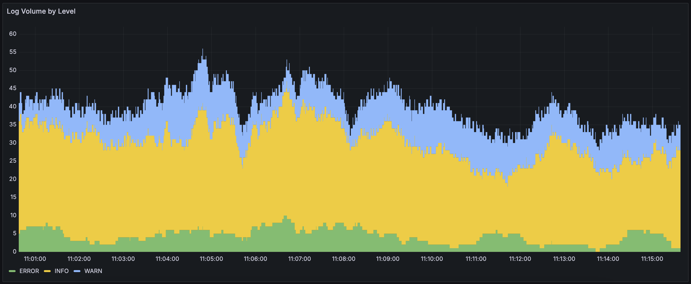
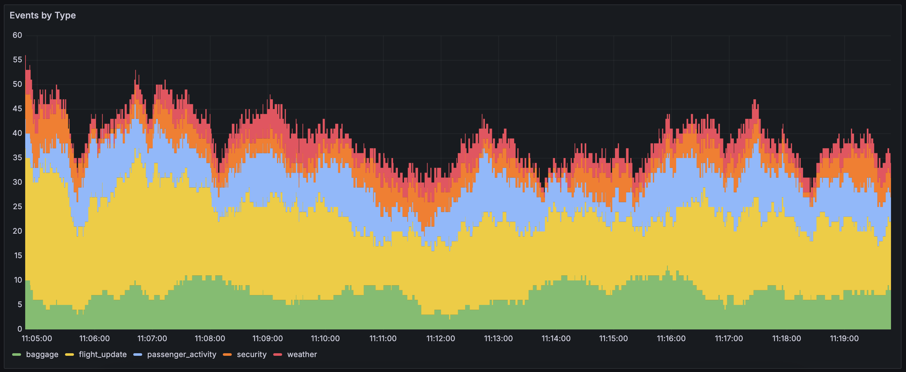
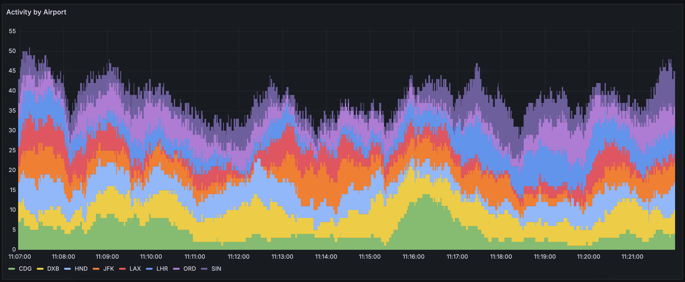
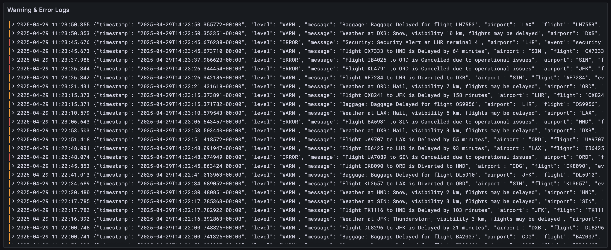
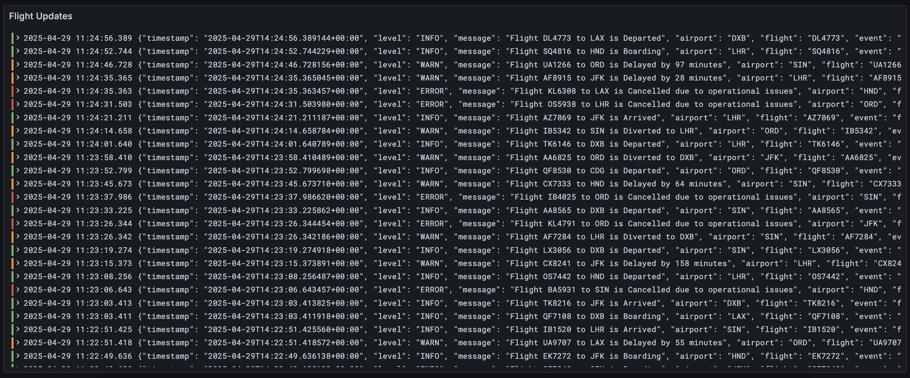
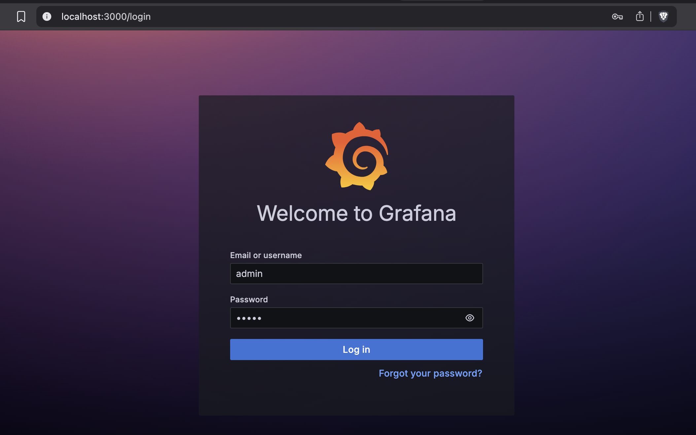
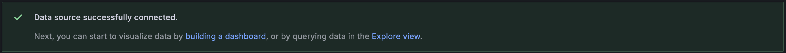
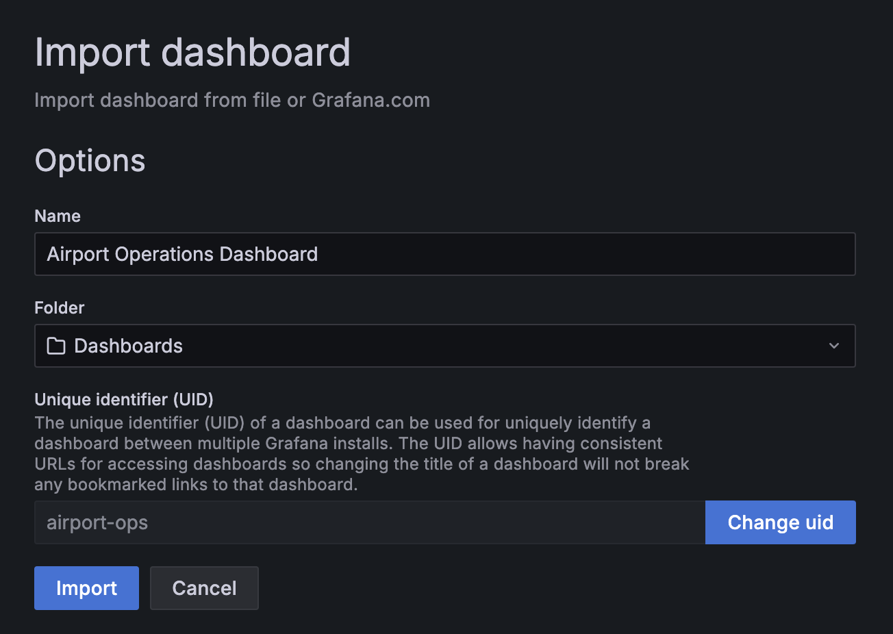
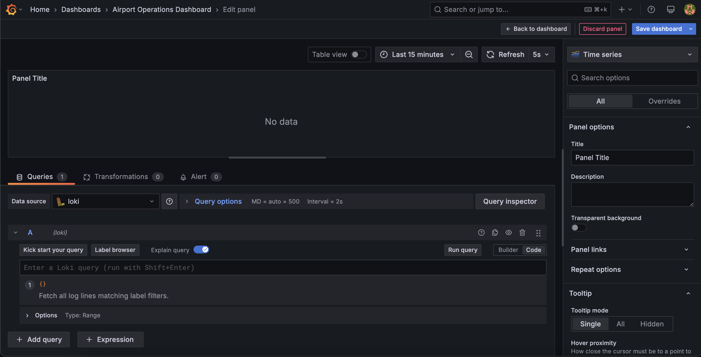

# [Unifor] Monitoramento e análise de logs

Repositório dedicado à disciplina **Monitoramento e análise de logs**, ministrada pelo professor Nauber Gois na Especialização em Engenharia de Software com DevOps, curso de pós-graduação lato sensu da Universidade de Fortaleza (UNIFOR).

<!-- START doctoc generated TOC please keep comment here to allow auto update -->
<!-- DON'T EDIT THIS SECTION, INSTEAD RE-RUN doctoc TO UPDATE -->
**Índice**  *gerado com [DocToc](https://github.com/thlorenz/doctoc)*

- [Airport Logging System](#airport-logging-system)
  - [Equipe](#equipe)
  - [Componentes do sistema](#componentes-do-sistema)
  - [Descrição dos arquivos](#descri%C3%A7%C3%A3o-dos-arquivos)
  - [Painéis de monitoramento](#pain%C3%A9is-de-monitoramento)
    - [Log Volume by Level](#log-volume-by-level)
    - [Events by Type](#events-by-type)
    - [Activity by Airport](#activity-by-airport)
    - [Warning & Error Logs](#warning--error-logs)
    - [Flight Updates](#flight-updates)
  - [Instruções para executar localmente](#instru%C3%A7%C3%B5es-para-executar-localmente)
    - [Pré-requisitos](#pr%C3%A9-requisitos)
    - [Iniciando a execução](#iniciando-a-execu%C3%A7%C3%A3o)
    - [Parando a execução](#parando-a-execu%C3%A7%C3%A3o)
  - [Customizações](#customiza%C3%A7%C3%B5es)
    - [Modificando o gerador de logs](#modificando-o-gerador-de-logs)
    - [Criando painéis adicionais](#criando-pain%C3%A9is-adicionais)
  - [Troubleshooting](#troubleshooting)

<!-- END doctoc generated TOC please keep comment here to allow auto update -->

## Airport Logging System

### Equipe

- Ismália Santiago (2328703)
- João Victor Mesquita (2416898)
- Pedro Luiz (2328034)
- Samuel Constatino (2419565)

### Componentes do sistema

1. **Grafana**: Plataforma de visualização (porta 3000).
1. **Loki**: Sistema de agregação de logs (porta 3100).
1. **Promtail**: Agente de coleta de logs.
1. **Airport Log Generator**: Script em Python 3.13 que gera logs simulados de diversos aeroportos.

### Descrição dos arquivos

- `airport_log_generator.py`: Script que gera os logs dos aeroportos.
- `airport-dashboard.json`: JSON com as configurações do dashboard do Grafana.
- `compose.yaml`: Define todos os serviços e suas configurações.
- `Dockerfile`: Dockerfile usado para criar a imagem do serviço gerador de logs.
- `loki-config.yaml`: Configurações de agregação de logs do Loki.
- `promtail-config.yaml`: Configurações de coleta de logs do Promtail.

### Painéis de monitoramento

Visualizações disponíveis no dashboard do Grafana.

#### Log Volume by Level



#### Events by Type



#### Activity by Airport



#### Warning & Error Logs



#### Flight Updates



### Instruções para executar localmente

#### Pré-requisitos

- Docker (v20.10 ou maior)
- Docker Compose (v2.0 ou maior)

#### Iniciando a execução

1. Execute o sistema usando Docker Compose:

```bash
docker compose up -d
```

2. Acesse o Grafana em http://localhost:3000
    - Username: `admin`
    - Password: `admin`



3. Adicione uma nova conexão com o Loki:
    - Acesse *Connections > Add new connection*.
    - Pesquise por **Loki** e selecione-o nos resultados.
    - Clique no botão no canto superior à direita, *Add new data source*.
    - Em *Settings*, configure a Connection URL como `http://loki:3100`.
    - No final de *Settings*, pressione o botão *Save & test* para validar se a conexão com o Loki foi bem sucedida.



4. Importe o dashboard:
    - Acesse *Dashboards*.
    - Clique no botão no canto superior à direita, *New*, e selecione **Import**.
    - Faça o upload do arquivo `airport-dashboard.json`, ou copie e cole o conteúdo desse arquivo. Em seguida, clique em *Import*.



#### Parando a execução

Para parar todos os serviços:

```bash
docker compose down
```

Para parar todos os serviços e remover todos os dados:

```bash
docker compose down
rm -rf grafana-storage logs loki-data
```

### Customizações

#### Modificando o gerador de logs

É possível customizar o gerador de logs editando o arquivo `airport_log_generator.py`. Pode-se modificar:

- A lista de aeroportos;
- Os tipos de eventos gerados;
- A frequência na qual os logs são gerados;
- A distribuição de log levels.

Após fazer as modificações, é necessário rebuildar e reiniciar os containers:

```bash
docker compose down
docker compose up -d --build
```

#### Criando painéis adicionais

É possível criar mais painéis no dashboard do Grafana para visualizar aspectos específicos dos logs dos aeroportos que não estejam cobertos pelos painéis em `airport-dashboard.json`.

1. Faça login no Grafana.
1. Acesse *Dashboard > Airport Operations Dashboard*.
1. No canto superior direito, acesse *Edit > Add > Visualization*.
1. Configure o painel com queries do Loki.
1. Salve o dashboard.



### Troubleshooting

1. Não consigo visualizar os dados no Grafana.
    - Verifique se todos os serviços estão rodando: `docker compose ps`.
    - Verifique se há erros nos logs do Loki: `docker compose logs loki`.
    - Verifique se o Promtail está coletando os logs: `docker compose logs promtail`.

2. O gerador de logs não está produzindo logs.
    - Verifique os logs do serviço *log-generator*: `docker compose logs log-generator`.
    - Verifique se o diretório dos logs tem as permissões necessárias de escrita.
